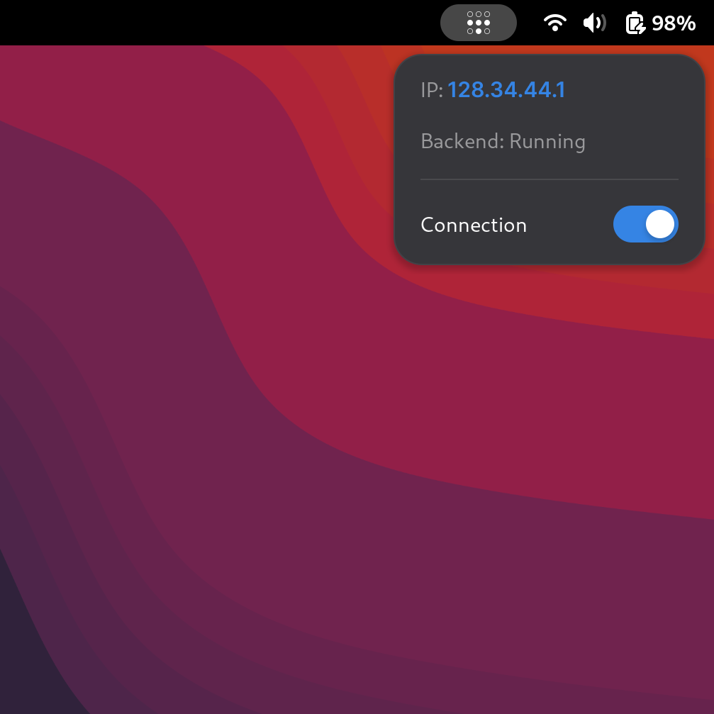

# GNOME Tails

A lightweight GNOME Shell extension providing a panel dropdown menu to monitor, toggle, and authenticate Tailscale directly from the top bar.

Tested and built for **GNOME Shell 47–49** on **Debian 13 (Trixie)**.

---

## Features

<p align="center">
  
</p>

- **Top Bar Indicator:** Displays Tailscale status using an SVG panel icon.
- **Connection Toggle:** Quick switch to run `tailscale up` and `tailscale down`.
- **IP & State Display:** Shows current backend state and Tailscale IPv4 address.
- **Web Authentication Helper:** Automatically detects `NeedsLogin` state and provides a direct one-click browser sign-in button.
- **Non-blocking Execution:** Uses asynchronous subprocesses (`Gio.Subprocess`) to keep the desktop shell fluid.

---

## Prerequisites

Allow your user account to execute Tailscale commands without entering root passwords:

```bash
sudo tailscale set --operator=$USER
```

---

## Installation & Setup

### Development Setup (Symlink)

Symlink the local `src/` directory to GNOME Shell's extension folder:

```bash
make dev
```

> **Important (First run on Wayland):** GNOME Shell only indexes new extension directories on startup. You must **log out and log back in** after running `make dev` for the first time.

After logging back in, enable the extension:

```bash
make enable
```

### Packaged Install

To build a standalone zip archive and install it directly via the shell manager:

```bash
make install
```

---

## Makefile Targets

| Target | Description |
|---|---|
| `make dev` | Symlinks `src/` to `~/.local/share/gnome-shell/extensions/` |
| `make pack` | Bundles the source into a `.shell-extension.zip` |
| `make install` | Packs and installs the archive via `gnome-extensions` |
| `make enable` | Enables the extension |
| `make disable` | Disables the extension |
| `make clean` | Removes packaged archives and cleans symlinks |

---

## Project Structure

```text
gnome-tails/
├── Makefile
├── README.md
├── .gitignore
└── src/
    ├── extension.js
    ├── metadata.json
    └── tailscale-symbolic.svg
```

---

## Debugging

To monitor real-time extension output and catch errors:

```bash
journalctl -f -o cat /usr/bin/gnome-shell | grep -E "Tailscale|tailscale-control"
```
